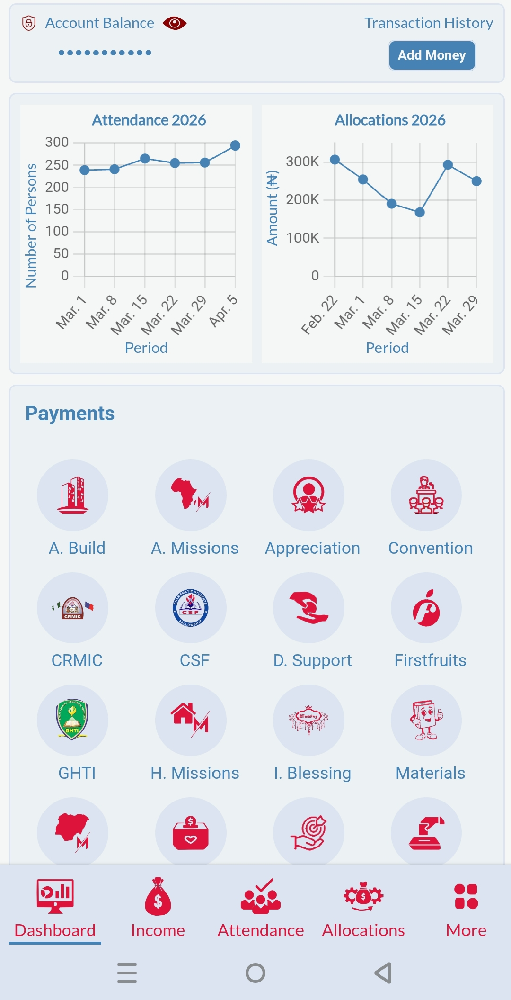
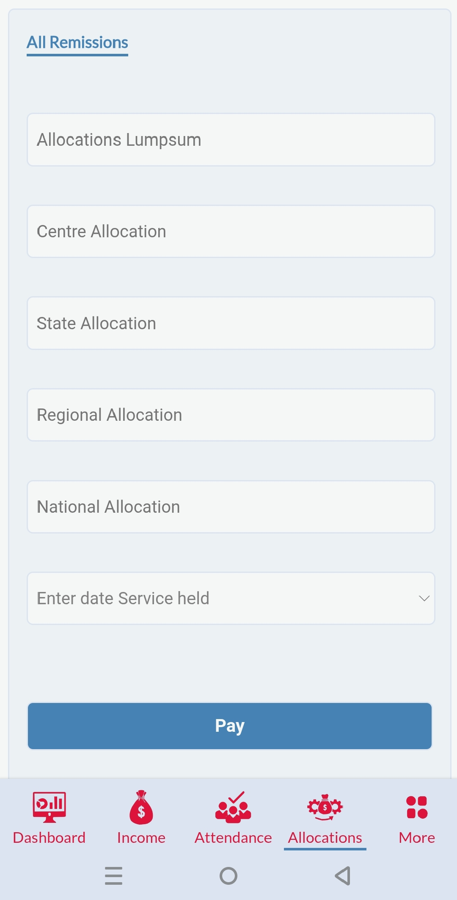
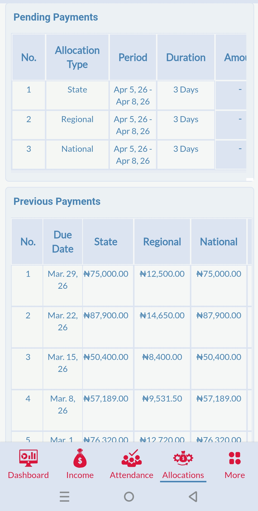

# Web Application (PHP, JavaScript, HTML/CSS)

This is a dynamic web application built to handle structured data, user interactions, and backend processing using PHP and JavaScript.

## 🔧 Features
- Database-driven architecture for storing and retrieving data
- Secure data handling and validation
- Interactive frontend using JavaScript
- Clean and responsive user interface

## 🚀 Live Demo
👉 https://your-live-link.com

## 💻 Technologies Used
- PHP
- JavaScript
- HTML & CSS
- MySQL

## 📸 Screenshots

### Dashboard View

### Data Entry Page

### Reports Page

## 📂 Project Structure
- `/assets` → CSS and JavaScript files  
- `/includes` → Backend logic and reusable components  
- `/screenshots` → Project preview images  

## ⚙️ How to Run Locally
1. Clone the repository  
2. Set up a local server (e.g., XAMPP)  
3. Import the database (if applicable)  
4. Run the project via `localhost`

## 👤 Author
Chimkamma Caleb Agbim  
Remote Web & Operations Support Contractor  
